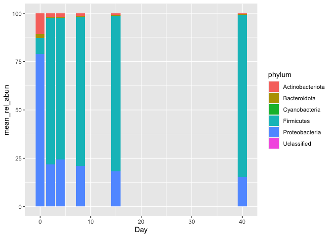

Data wrangling from amplicon sequencing
================
Johan S. Sáenz

- <a href="#setting-the-working-space"
  id="toc-setting-the-working-space">Setting the working space</a>
- <a href="#clean-taxonomy-file" id="toc-clean-taxonomy-file">Clean
  taxonomy file</a>

## Setting the working space

``` r
setwd("~/Documents/github/coding_club/")

pacman::p_load(tidyverse,
               patchwork, 
               ggtext)
```

You can add options to executable code like this

``` r
counts <- read_tsv("raw_data/feature-table_ampli.tsv")

taxonomy <- read_tsv("raw_data/taxonomy_ampli.tsv")

metadata <-  read_tsv("raw_data/weight_ph_data.txt")
```

## Clean taxonomy file

We need to

``` r
taxonomy <- read_tsv("raw_data/taxonomy_ampli.tsv") %>% 
  rename(OTUID='Feature ID') %>%
  separate(Taxon,
           into=c("superkingdom", "phylum", "class", "order", "family", "genus", "species"),
           sep = ";")

head(taxonomy)
```

    # A tibble: 6 × 9
      OTUID                  super…¹ phylum class order family genus species Confi…²
      <chr>                  <chr>   <chr>  <chr> <chr> <chr>  <chr> <chr>     <dbl>
    1 b7baa37944fb48185b3cc… d__Bac… " p__… " c_… " o_… " f__… " g_… " s__W…   1.00 
    2 a82a5a7c35c28c40ed5a3… d__Bac… " p__… " c_… " o_… " f__… " g_… " s__L…   0.956
    3 1bfdaa567ac92f2e89705… d__Bac… " p__… " c_… " o_… " f__… " g_…  <NA>     0.999
    4 e28bc9caeabd276628e70… d__Bac… " p__… " c_… " o_… " f__… " g_…  <NA>     0.997
    5 97b761526814e975f8e72… d__Bac… " p__… " c_… " o_… " f__… " g_… " s__W…   0.943
    6 ae218b0c831c009018603… d__Bac… " p__… " c_… " o_… " f__… " g_… " s__L…   0.957
    # … with abbreviated variable names ¹​superkingdom, ²​Confidence

``` r
mean_rel <- counts %>% 
  pivot_longer(-OTUID,
               names_to = "sample",
               values_to = "counts") %>%
  inner_join(metadata, by=c("sample"="Sample")) %>% 
  select(OTUID, sample, counts, Day)

head(mean_rel)
```

    # A tibble: 6 × 4
      OTUID                            sample counts   Day
      <chr>                            <chr>   <dbl> <dbl>
    1 b7baa37944fb48185b3ccd35739564a1 C15A     7068    15
    2 b7baa37944fb48185b3ccd35739564a1 C15B     6498    15
    3 b7baa37944fb48185b3ccd35739564a1 C15C     7198    15
    4 b7baa37944fb48185b3ccd35739564a1 C2A      8357     2
    5 b7baa37944fb48185b3ccd35739564a1 C2B      7573     2
    6 b7baa37944fb48185b3ccd35739564a1 C2C      7124     2

``` r
mean_rel <- mean_rel %>% 
  inner_join(taxonomy, by="OTUID") %>% 
  group_by(sample, Day, phylum) %>% 
  summarise(counts=sum(counts),
            .groups = "drop") %>% 
  group_by(sample) %>% 
  mutate(rel_abund = 100*(counts/sum(counts))) %>% 
  group_by(Day, phylum) %>%
  summarise(mean_rel =mean(rel_abund),
            .groups = "drop")
```

``` r
taxon_pool <- mean_rel %>%
  group_by(phylum) %>%
  summarise(pool = max(mean_rel) < 5,
            mean=mean(mean_rel),
            .groups = "drop")  

head(taxon_pool)
```

    # A tibble: 6 × 3
      phylum                 pool     mean
      <chr>                  <lgl>   <dbl>
    1 " p__Actinobacteriota" FALSE  2.80  
    2 " p__Bacteroidota"     TRUE   0.867 
    3 " p__Cyanobacteria"    TRUE   0.0286
    4 " p__Firmicutes"       FALSE 66.3   
    5 " p__Proteobacteria"   FALSE 30.0   
    6  <NA>                  TRUE   0.0222

``` r
pool_mean_rel <- inner_join(taxon_pool, mean_rel, by="phylum") %>%
  mutate(phylum=if_else(pool, "Other", phylum)) %>%
  group_by(Day, phylum) %>%
  summarise(mean_rel=sum(mean_rel),
            mean =sum(mean),
            .groups ="drop") %>%
  mutate(genus=factor(phylum),
         genus=fct_reorder(phylum, mean,
                           .desc = TRUE))
```

[Color
Brewer](https://colorbrewer2.org/#type=sequential&scheme=BuGn&n=3)

``` r
bar_colors <- c('#8dd3c7','#ffffb3','#bebada','#fb8072','#80b1d3','#fdb462',
                '#b3de69','#fccde5','#d9d9d9','#bc80bd')
```

``` r
  pool_mean_rel %>% 
    ggplot(aes(x=factor(Day,
                      levels = c(0,2,4,8,15,40)),
             y=mean_rel,
             fill=phylum)) +
  geom_col() +
  scale_y_continuous(expand = c(0,0)) +
  scale_fill_manual(values=bar_colors) + 
  labs(x="Day",
       y="Relative abundance (%)") +
  theme_classic() +
  theme(legend.title = element_blank(),
        legend.text = element_text(face = "italic"),
        axis.text = element_text(size = 14),
        axis.title = element_text(size = 15))
```


