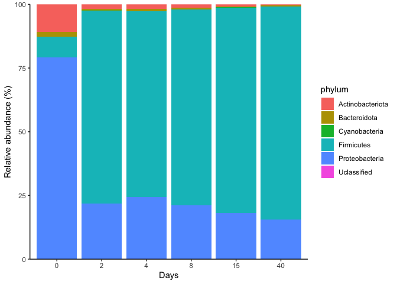

Data wrangling from amplicon sequencing
================
Johan S. Sáenz

- <a href="#setting-the-working-space"
  id="toc-setting-the-working-space">Setting the working space</a>
- <a href="#clean-taxonomy-file" id="toc-clean-taxonomy-file">Clean
  taxonomy file</a>
- <a href="#pivot-the-data-and-add-taxonomy-information"
  id="toc-pivot-the-data-and-add-taxonomy-information">Pivot the data and
  add taxonomy information</a>
- <a href="#replace-taxon-names" id="toc-replace-taxon-names">Replace
  taxon names</a>
- <a href="#calculate-relative-abundance"
  id="toc-calculate-relative-abundance">Calculate relative abundance</a>
- <a href="#add-metadata-and-calculate-mean-relative-abundance-per-group"
  id="toc-add-metadata-and-calculate-mean-relative-abundance-per-group">Add
  metadata and calculate mean relative abundance per group</a>
- <a href="#create-a-bar-plot" id="toc-create-a-bar-plot">Create a bar
  plot</a>
- <a
  href="#create-a-factor-with-the-data-correct-x-axis-and-pimp-your-plot"
  id="toc-create-a-factor-with-the-data-correct-x-axis-and-pimp-your-plot">Create
  a factor with the data (correct x-axis) and PIMP your plot</a>
- <a href="#select-colors-for-bar-plot"
  id="toc-select-colors-for-bar-plot">Select colors for bar plot</a>

This tutorial would guide you across the data analysis of amplicon
sequences obtained from grass ensilaging during 40 days.

<figure>

<figcaption aria-hidden="true">Grass ensilagin in glass jars durion 40
days</figcaption>
</figure>

## Setting the working space

First, we need to organize and set up our working environment. You need
to create a **project** folder an inside that, you should create
**code**, **rawdata** and **figures** folder. Move all the data to the
**rawdata** folder.

Use the function `setwd()` to select the current working directory of
the **R** processes.

Use `install.packages()` to install necessary libraries and `library()`
to load the package. You need to install the packages once in your
installation life time but `library()` must be run every new session.

``` r
#setting working direectory
setwd("~/Documents/github/coding_club/")

#install.packages("tidyverse")
library(tidyverse)
```

    ── Attaching packages ─────────────────────────────────────── tidyverse 1.3.2 ──
    ✔ ggplot2 3.3.6      ✔ purrr   0.3.4 
    ✔ tibble  3.1.8      ✔ dplyr   1.0.10
    ✔ tidyr   1.2.1      ✔ stringr 1.4.1 
    ✔ readr   2.1.2      ✔ forcats 0.5.2 
    ── Conflicts ────────────────────────────────────────── tidyverse_conflicts() ──
    ✖ dplyr::filter() masks stats::filter()
    ✖ dplyr::lag()    masks stats::lag()

Next, use the functions `read.table()` or `read_tsv()` to load the data
frames located in the **rawdata** folder. This new object should be
visible in your environment.

``` r
counts <- read.table("raw_data/feature-table_ampli.tsv",
                     header = TRUE, #it recognize first row as header
                     sep = "\t") #how is the file separated (e.g ",", ";")

taxonomy <- read_tsv("raw_data/taxonomy_ampli.tsv")

metadata <-  read_tsv("raw_data/weight_ph_data.txt") %>% 
             rename(samples=Sample)
```

## Clean taxonomy file

The taxonomy file has several problems:

1.  The column containing the **OTUID** is call **Feature ID.** We can
    rename it using `rename()`

2.  The taxon variable contain all the taxonomic levels in one string.
    We can separate it using `separate().`The option `sep=""` can be
    used to separate the string by different characters. In this case we
    use the **;** character.

3.  We want to have a clean and simple data frame. Because of that we
    can select the wanted variables using `select()` and the names of
    the variables.

4.  The phylum names contain the extra characters ” p\_\_“, which create
    noise in our analysis. We can use `mutate()` combine with
    `str_replace()`, to modify the string in the phylum variable.
    **Notice that we are not creating a new variable but modifying the
    existing one.**

<div>

> **Note**
>
> Try to replace “p\_\_” by other string. For example “Phylum:”

</div>

``` r
taxonomy <- read_tsv("raw_data/taxonomy_ampli.tsv") %>% 
  rename(OTUID='Feature ID') %>%
  separate(Taxon,
           into=c("superkingdom", "phylum", "class", "order", "family", "genus", "species"),
           sep = ";") %>%
  select(OTUID, phylum) %>% 
  mutate(phylum=str_replace(phylum, " p__", ""))

head(taxonomy) #check the first 5 row of the dataframe
```

    # A tibble: 6 × 2
      OTUID                            phylum        
      <chr>                            <chr>         
    1 b7baa37944fb48185b3ccd35739564a1 Firmicutes    
    2 a82a5a7c35c28c40ed5a305f97da5279 Firmicutes    
    3 1bfdaa567ac92f2e89705c00eccc1787 Proteobacteria
    4 e28bc9caeabd276628e70bea91c2db48 Proteobacteria
    5 97b761526814e975f8e72239f997a31e Firmicutes    
    6 ae218b0c831c009018603ea094d96eb7 Firmicutes    

In this example, you should obtained a data frame with the dimension
324x2. The two variables are the **OTUID** and the taxonomic level
**phylum**.

## Pivot the data and add taxonomy information

R works better with long data frames. Because of that we can transform
our data frame using `pivot_longer()`. With this function all the names
from the columns are re organize in a new variable as well as their
values per row (`names_to` and `values_to`). When you pivot a data
frame, at least one variable should not be pivot. In this cases we use
**-OTUID** to indicate the column.

The **counts** data frame and **taxonomy** share a common variable
(**OTUID**). We can use that variable to merge the data using
`inner_join()`. `inner_join()` would keep all rows that are share by
both data frames.

<div>

> **Note**
>
> Check the function `left_join()`, `right_join()`, `full_join()` and
> `pivot_wider()`. Do you get a different result joining the data?.

</div>

``` r
counts %>% 
  pivot_longer(-OTUID,
               names_to = "samples",
               values_to = "values") %>%
  inner_join(taxonomy, by="OTUID") 
```

    # A tibble: 5,814 × 4
       OTUID                            samples values phylum    
       <chr>                            <chr>    <int> <chr>     
     1 b7baa37944fb48185b3ccd35739564a1 C15A      7068 Firmicutes
     2 b7baa37944fb48185b3ccd35739564a1 C15B      6498 Firmicutes
     3 b7baa37944fb48185b3ccd35739564a1 C15C      7198 Firmicutes
     4 b7baa37944fb48185b3ccd35739564a1 C2A       8357 Firmicutes
     5 b7baa37944fb48185b3ccd35739564a1 C2B       7573 Firmicutes
     6 b7baa37944fb48185b3ccd35739564a1 C2C       7124 Firmicutes
     7 b7baa37944fb48185b3ccd35739564a1 C40A      4524 Firmicutes
     8 b7baa37944fb48185b3ccd35739564a1 C40B      6459 Firmicutes
     9 b7baa37944fb48185b3ccd35739564a1 C40C      4730 Firmicutes
    10 b7baa37944fb48185b3ccd35739564a1 C4A       6459 Firmicutes
    # … with 5,804 more rows

## Replace taxon names

``` r
counts %>% 
  pivot_longer(-OTUID,
               names_to = "samples",
               values_to = "values") %>%
  inner_join(taxonomy, by="OTUID") %>% 
  mutate(phylum=if_else(is.na(phylum), "Uclassified", phylum))
```

    # A tibble: 5,814 × 4
       OTUID                            samples values phylum    
       <chr>                            <chr>    <int> <chr>     
     1 b7baa37944fb48185b3ccd35739564a1 C15A      7068 Firmicutes
     2 b7baa37944fb48185b3ccd35739564a1 C15B      6498 Firmicutes
     3 b7baa37944fb48185b3ccd35739564a1 C15C      7198 Firmicutes
     4 b7baa37944fb48185b3ccd35739564a1 C2A       8357 Firmicutes
     5 b7baa37944fb48185b3ccd35739564a1 C2B       7573 Firmicutes
     6 b7baa37944fb48185b3ccd35739564a1 C2C       7124 Firmicutes
     7 b7baa37944fb48185b3ccd35739564a1 C40A      4524 Firmicutes
     8 b7baa37944fb48185b3ccd35739564a1 C40B      6459 Firmicutes
     9 b7baa37944fb48185b3ccd35739564a1 C40C      4730 Firmicutes
    10 b7baa37944fb48185b3ccd35739564a1 C4A       6459 Firmicutes
    # … with 5,804 more rows

``` r
#An example for a different string
data.frame(taxon=c("candidatus xy", "candidatus Johan", "candidatus_xy", 
                   "unclassified xy","unclassified_xz")) %>% 
  mutate(taxon=str_replace(taxon, "candidatus.*", "Unclassified"),
         taxon=str_replace(taxon, "unclassified.*", "Unclassifed"))
```

             taxon
    1 Unclassified
    2 Unclassified
    3 Unclassified
    4  Unclassifed
    5  Unclassifed

## Calculate relative abundance

``` r
counts %>% 
  pivot_longer(-OTUID,
               names_to = "samples",
               values_to = "values") %>%
  inner_join(taxonomy, by="OTUID") %>% 
  mutate(phylum=if_else(is.na(phylum), "Uclassified", phylum)) %>% 
  group_by(samples, phylum) %>% 
  summarise(sum_values =sum(values), .groups = "drop") %>% 
  group_by(samples) %>% 
  mutate(rel_abun = 100*(sum_values/sum(sum_values)))
```

    # A tibble: 108 × 4
    # Groups:   samples [18]
       samples phylum           sum_values rel_abun
       <chr>   <chr>                 <int>    <dbl>
     1 C15A    Actinobacteriota        167   0.642 
     2 C15A    Bacteroidota             70   0.269 
     3 C15A    Cyanobacteria             7   0.0269
     4 C15A    Firmicutes            20708  79.6   
     5 C15A    Proteobacteria         5048  19.4   
     6 C15A    Uclassified               0   0     
     7 C15B    Actinobacteriota        281   1.08  
     8 C15B    Bacteroidota            150   0.577 
     9 C15B    Cyanobacteria             0   0     
    10 C15B    Firmicutes            21251  81.7   
    # … with 98 more rows

## Add metadata and calculate mean relative abundance per group

``` r
counts %>% 
  pivot_longer(-OTUID,
               names_to = "samples",
               values_to = "values") %>%
  inner_join(taxonomy, by="OTUID") %>% 
  mutate(phylum=if_else(is.na(phylum), "Uclassified", phylum)) %>% 
  group_by(samples, phylum) %>% 
  summarise(sum_values =sum(values), .groups = "drop") %>% 
  group_by(samples) %>% 
  mutate(rel_abun = 100*(sum_values/sum(sum_values))) %>% 
  inner_join(metadata, by="samples") %>% 
  select(samples, phylum, Day, rel_abun) %>% 
  group_by(phylum, Day) %>% 
  summarise(mean_rel_abun = mean(rel_abun))
```

    # A tibble: 36 × 3
    # Groups:   phylum [6]
       phylum             Day mean_rel_abun
       <chr>            <dbl>         <dbl>
     1 Actinobacteriota     0        10.8  
     2 Actinobacteriota     2         1.77 
     3 Actinobacteriota     4         1.76 
     4 Actinobacteriota     8         1.22 
     5 Actinobacteriota    15         0.773
     6 Actinobacteriota    40         0.491
     7 Bacteroidota         0         2.02 
     8 Bacteroidota         2         0.749
     9 Bacteroidota         4         0.892
    10 Bacteroidota         8         0.829
    # … with 26 more rows

## Create a bar plot

**`ggplot`** is on of the more powerful tools in R. It will allow you to
create several simple and complex plots. Lets start with a bar plot.

We can connect the `ggplot()` function with our pipe but after, all
`ggplot` layers must be conected with the `+`symbol. Everything inside
the Aesthetic mappings (`aes()`) describe how variables in the data are
mapped to visual properties. In this case we are mapping the samples
with the counts and filling the bars with the phylum names.

``` r
counts %>% 
  pivot_longer(-OTUID,
               names_to = "samples",
               values_to = "values") %>%
  inner_join(taxonomy, by="OTUID") %>% 
  mutate(phylum=if_else(is.na(phylum), "Uclassified", phylum)) %>% 
  group_by(samples, phylum) %>% 
  summarise(sum_values =sum(values), .groups = "drop") %>% 
  group_by(samples) %>% 
  mutate(rel_abun = 100*(sum_values/sum(sum_values))) %>% 
  inner_join(metadata, by="samples") %>% 
  select(samples, phylum, Day, rel_abun) %>% 
  group_by(phylum, Day) %>% 
  summarise(mean_rel_abun = mean(rel_abun), .groups = "drop") %>% 
  ggplot(aes(x = Day,
             y = mean_rel_abun,
             fill = phylum)) +
  geom_bar(stat = "identity")
```


## Create a factor with the data (correct x-axis) and PIMP your plot

``` r
counts %>% 
  pivot_longer(-OTUID,
               names_to = "samples",
               values_to = "values") %>%
  inner_join(taxonomy, by="OTUID") %>% 
  mutate(phylum=if_else(is.na(phylum), "Uclassified", phylum)) %>% 
  group_by(samples, phylum) %>% 
  summarise(sum_values =sum(values), .groups = "drop") %>% 
  group_by(samples) %>% 
  mutate(rel_abun = 100*(sum_values/sum(sum_values))) %>% 
  inner_join(metadata, by="samples") %>% 
  select(samples, phylum, Day, rel_abun) %>% 
  group_by(phylum, Day) %>% 
  summarise(mean_rel_abun = mean(rel_abun), .groups = "drop") %>% 
  ggplot(aes(x = factor(Day,
                        levels = c(0, 2,4,8,15,40)), 
             y = mean_rel_abun,
             fill = phylum)) +
  geom_bar(stat = "identity") +
  scale_y_continuous(expand = c(0,0)) + # modify scale 
  labs(x ="Days", # axis names
       y = "Relative abundance (%)") +
  theme_classic()
```


## Select colors for bar plot

By default, if you do not set or select a color palette, R would do it
for you. That is not always the best option. Explore the tool [Color
Brewer](https://colorbrewer2.org/#type=sequential&scheme=BuGn&n=3) to
pull 8 different colors and create a vector as shown below.

After, you can add a new layer to the pipe to set the color palette
chosen by you using `scale_fill_manual(values = bar_colors)`

``` r
col_values <- c('#e41a1c','#377eb8','#4daf4a','#984ea3',
                 '#ff7f00','#ffff33')

counts %>% 
  pivot_longer(-OTUID,
               names_to = "samples",
               values_to = "values") %>%
  inner_join(taxonomy, by="OTUID") %>% 
  mutate(phylum=if_else(is.na(phylum), "Uclassified", phylum)) %>% 
  group_by(samples, phylum) %>% 
  summarise(sum_values =sum(values), .groups = "drop") %>% 
  group_by(samples) %>% 
  mutate(rel_abun = 100*(sum_values/sum(sum_values))) %>% 
  inner_join(metadata, by="samples") %>% 
  select(samples, phylum, Day, rel_abun) %>% 
  group_by(phylum, Day) %>% 
  summarise(mean_rel_abun = mean(rel_abun), .groups = "drop") %>% 
  ggplot(aes(x = factor(Day,
                        levels = c(0, 2,4,8,15,40)), 
             y = mean_rel_abun,
             fill = phylum)) +
  geom_bar(stat = "identity") +
  scale_y_continuous(expand = c(0,0)) +
  scale_fill_manual(values = col_values)# modify scale 
```



``` r
  labs(x ="Days", # axis names
       y = "Relative abundance (%)") +
  theme_classic()
```

    NULL
